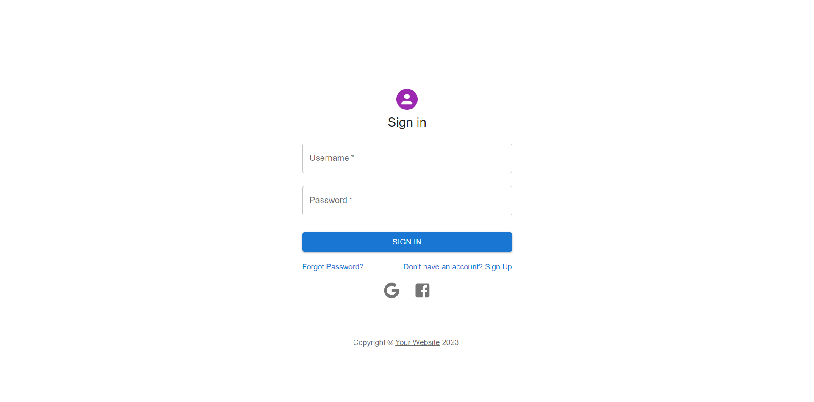
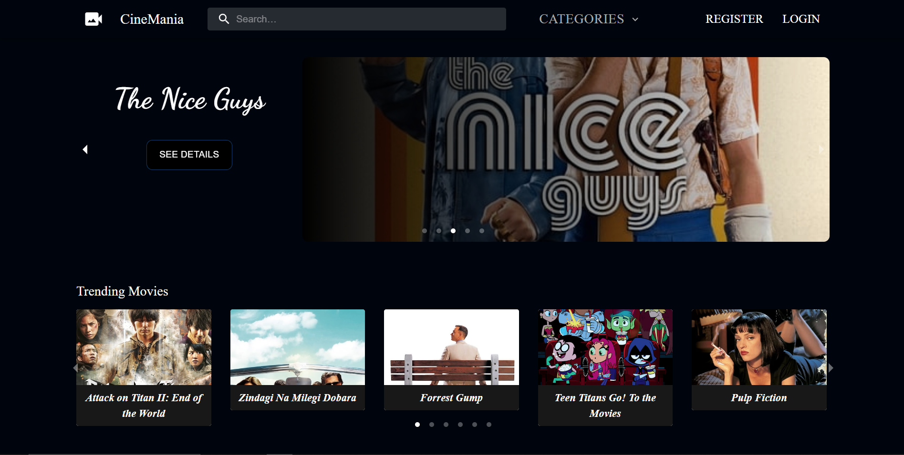
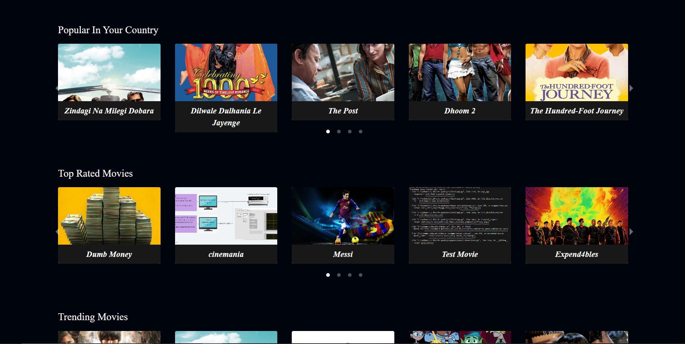
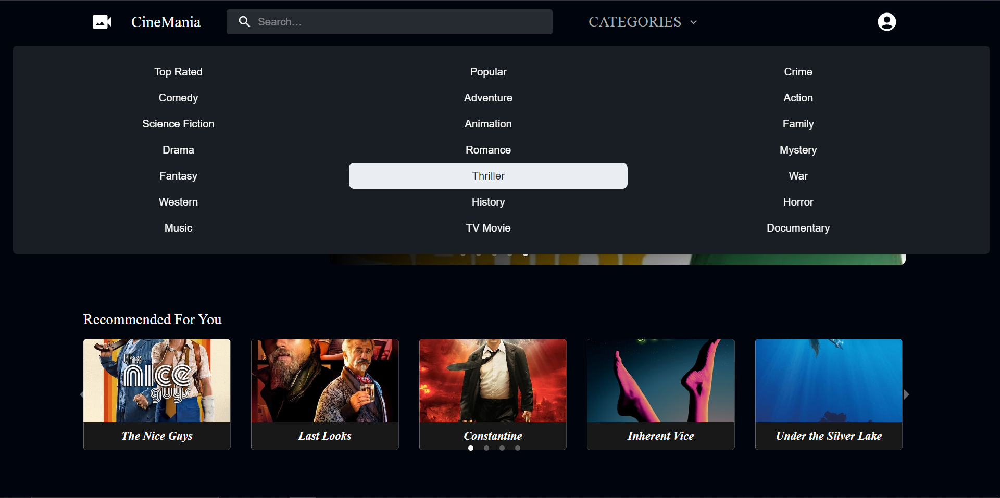
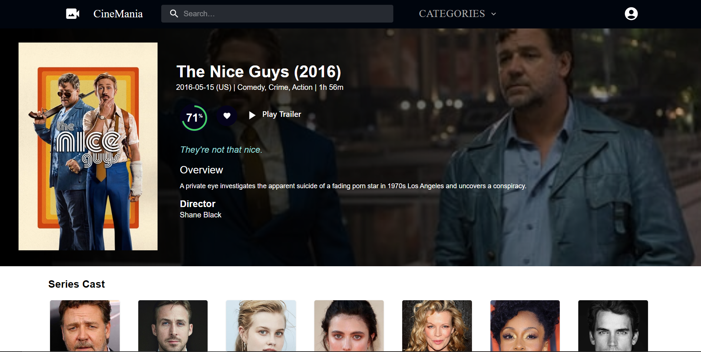
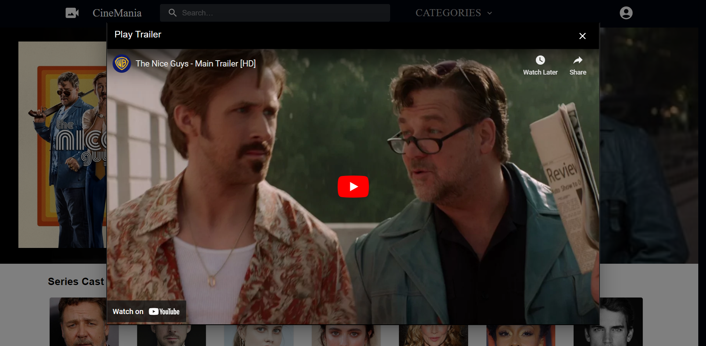

# Cinemania

Cinemania is a movie recommendation platform that offers personalized movie suggestions, diverse movie categories, user authentication, and admin movie management. This project was developed as a group project from September 2023 to October 2023.

## Features

### 1. Personalized Recommendations

Cinemania provides users with personalized movie recommendations based on their preferences and viewing history. The recommendation engine tailors suggestions to enhance the user experience.

### 2. Diverse Movie Categories

Users can explore movies in various categories, including popular releases, regional favorites, and trending titles in their country. The platform aims to cater to a wide range of movie preferences.

### 3. User Authentication and Profiles

The system includes user authentication to ensure secure access. Users can create profiles to manage their preferences, track viewing history, and receive personalized recommendations.

### 4. Admin Movie Management

An admin role is implemented to manage movie data. Admins have the ability to add, edit, and update movie information in the system, ensuring that the platform stays up-to-date with the latest releases and accurate details.

## Getting Started

To set up and begin using Cinemania, follow these simple steps:

1. **Clone the Repository:**

   ```bash
   git clone https://github.com/Rebel9829/Cinemania
   ```

2. **Configure Database and Authentication:** Head to the server directory and add a .env file to set up your database and authentication settings.
   ```bash
   # Cinemania Configuration (Example .env file)

   # Port for the API server
   API_PORT=5000
   
   # MongoDB URI for database connection
   MONGO_URI=your_mongo_uri
   
   # Localhost URL for the client application
   LOCALHOST=http://localhost:3000/
   
   # Authentication Token for secure communication
   AUTH_TOKEN=
   
   # SMTP email configuration for sending emails
   MAIL_USERNAME=
   MAIL_PASSWORD=
   
   # Google OAuth configuration for user authentication
   OAUTH_CLIENTID=
   OAUTH_CLIENT_SECRET=
   OAUTH_REFRESH_TOKEN=
   
   # Facebook OAuth configuration for integration
   CLIENT_ID=
   CLIENT_SECRET=
   APP_ID=
   APP_SECRET=

   ```
3. **Set Up the Client:** Navigate to the Client directory, install the necessary dependencies, and start the client application:
   ```bash
   cd Client
   npm install   # or yarn install
   npm start
   ```
4. **Run Datamind:** Access the Datamind directory, install the required dependencies, and execute the datamind module:
   ```bash
   cd Datamind
   pip install -r requirements.txt
   py main.py
   ```
These steps will have Cinemania up and running on your local environment!
## Usage

1. Users can sign up or log in to access personalized movie recommendations.
2. Explore movies in various categories to discover new and exciting titles.
3. Admins can manage movie data through the admin access credentials.

## Images

### Authentication



### Home Page




### Choose Different Categories



### Movie Page




### Watch Movie Trailer



## Conclusion
Thank you for exploring Cinemania! We hope you enjoy discovering and watching movies tailored to your preferences.
